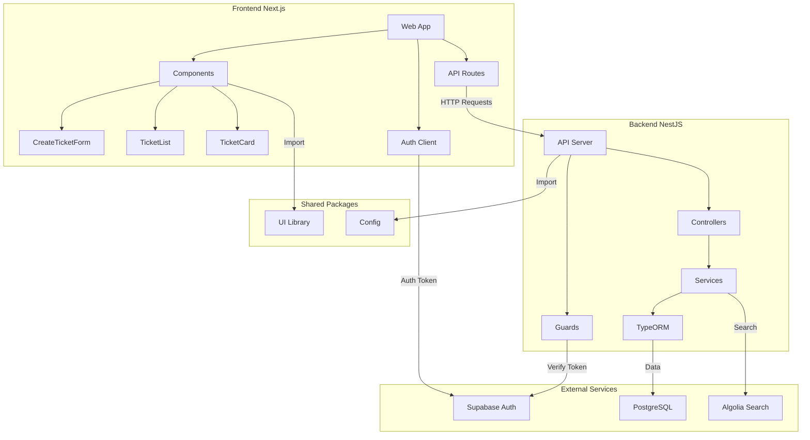

# Full Stack Squash - Support Ticket System

A modern support ticket management system built with Next.js, NestJS, and Supabase.

## 🚀 Features

- **Authentication**: Secure authentication using Supabase
- **Ticket Management**: Create, read, update, and delete support tickets
- **Real-time Updates**: Live ticket status updates
- **Search & Filter**: Find tickets quickly (powered by Algolia)
- **Responsive Design**: Mobile-friendly interface using Tailwind CSS

## 🏗️ Architecture

The following diagram illustrates the high-level architecture and data flow of the application:



### Key Components

1. **Frontend (Next.js)**
   - React components for UI
   - API routes for data fetching
   - Supabase client for authentication
   - Real-time updates using WebSocket

2. **Backend (NestJS)**
   - RESTful API endpoints
   - Authentication guards
   - Business logic in services
   - Database operations via TypeORM

3. **External Services**
   - Supabase: Authentication and user management
   - PostgreSQL: Primary database
   - Algolia: Search functionality

4. **Shared Packages**
   - UI: Reusable components
   - Config: Shared configuration and types

## 🏗️ Tech Stack

### Frontend (apps/web)
- Next.js 14 (App Router)
- Tailwind CSS
- Shadcn/UI Components
- TypeScript
- Supabase Client

### Backend (apps/api)
- NestJS
- TypeORM
- PostgreSQL
- Supabase Auth
- Algolia Search

### Shared (packages)
- UI Component Library
- TypeScript Types
- Shared Utilities

## 📦 Project Structure

```
full-stack-squash/
├── apps/
│   ├── api/           # NestJS Backend
│   └── web/           # Next.js Frontend
├── packages/
│   ├── ui/            # Shared UI Components
│   └── config/        # Shared Configuration
└── rest-client/       # API Test Files
```

## 🚦 Getting Started

### Prerequisites
- Node.js (v18+)
- PNPM
- PostgreSQL
- Supabase Account
- Algolia Account (optional)

### Environment Variables

#### Backend (.env in apps/api)
```env
# Database
DB_HOST=localhost
DB_USER=your_db_user
DB_PASSWORD=your_db_password
DB_NAME=your_db_name

# Supabase
SUPABASE_URL=your_supabase_url
SUPABASE_ANON_KEY=your_supabase_anon_key
SUPABASE_SERVICE_ROLE_KEY=your_supabase_service_role_key

# Algolia (optional)
ALGOLIA_APP_ID=your_algolia_app_id
ALGOLIA_ADMIN_KEY=your_algolia_admin_key
```

#### Frontend (.env in apps/web)
```env
NEXT_PUBLIC_SUPABASE_URL=your_supabase_url
NEXT_PUBLIC_SUPABASE_ANON_KEY=your_supabase_anon_key
NEXT_PUBLIC_API_URL=http://localhost:3099
```

### Installation

1. Clone the repository
```bash
git clone https://github.com/yourusername/full-stack-squash.git
cd full-stack-squash
```

2. Install dependencies
```bash
pnpm install
```

3. Start the development servers
```bash
# Start backend
cd apps/api
pnpm start:dev

# In another terminal, start frontend
cd apps/web
pnpm dev
```

## 🎯 Core Features

### Ticket Management
- Create new support tickets
- Assign priority levels
- Track ticket status
- Add comments and updates
- Assign tickets to team members

### Authentication
- Secure login using Supabase
- Role-based access control
- Protected API endpoints

### Search
- Full-text search using Algolia
- Filter by status, priority, and assignee
- Sort by various fields

## 📝 Database Schema

### Ticket
- `id`: Primary Key
- `title`: String (required)
- `description`: String (optional)
- `status`: Enum ('open', 'in_progress', 'resolved', 'closed')
- `assignedTo`: String (optional)
- `priority`: Enum ('low', 'medium', 'high')
- `createdAt`: Timestamp
- `updatedAt`: Timestamp

## 🔒 Security

- Authentication using Supabase JWT tokens
- API endpoints protected with Guards
- CORS configuration for frontend access
- Environment variables for sensitive data

## 🧪 Testing

```bash
# Run backend tests
cd apps/api
pnpm test

# Run frontend tests
cd apps/web
pnpm test
```

## 🚀 Deployment

### Backend
1. Set `synchronize: false` in TypeORM config
2. Run database migrations
3. Deploy to your preferred hosting platform

### Frontend
1. Build the Next.js application
2. Deploy to Vercel or your preferred platform

## 📚 Contributing

1. Fork the repository
2. Create a feature branch
3. Commit your changes
4. Push to the branch
5. Open a Pull Request

## 📄 License

This project is licensed under the MIT License - see the LICENSE file for details.